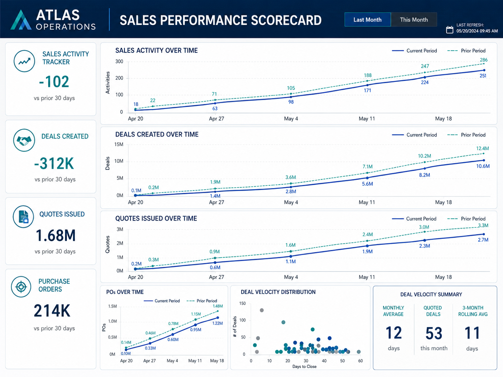
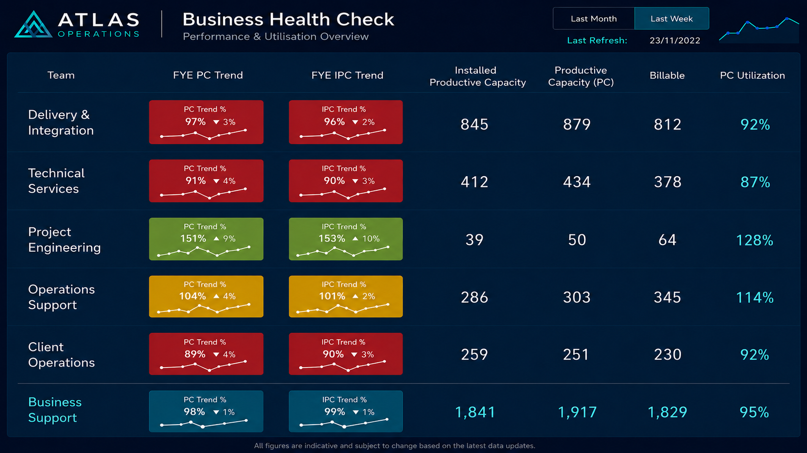
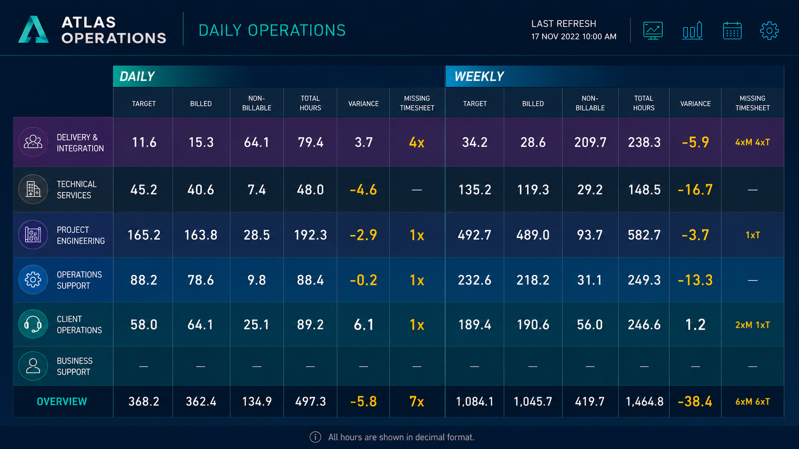

# Operational Analytics Portfolio

An anonymized BI and operational analytics portfolio based on previous professional work in an engineering consulting environment.

This portfolio demonstrates how business intelligence, automated reporting and operational analytics can improve visibility, accountability and decision-making across sales, workforce planning and daily operations.

Branding, values, names, team structures and sensitive details have been modified for confidentiality. The examples preserve the business logic and analytical approach without disclosing proprietary information.

## Full Portfolio PDF

[Download the full portfolio PDF](portfolio/Luis_Vergara_Operational_Analytics_Portfolio.pdf)

## Case Studies

### 1. Sales Performance Scorecard

A sales analytics dashboard designed to improve visibility across sales activities, deals created, quotes issued, purchase orders, quote velocity and commercial pipeline performance.

The dashboard helped leadership move from fragmented spreadsheets and informal updates into a clearer KPI-driven reporting process.

**Skills demonstrated**

- Power BI dashboard development
- Sales analytics
- KPI design
- CRM reporting
- Quote velocity tracking
- Commercial reporting
- Executive reporting

---

### 2. Business Health Check

An operational analytics dashboard designed to monitor team utilisation, productive capacity, billable activity and business unit performance.

The dashboard supported leadership and operational managers by connecting delivery capacity with financial and workforce visibility.

**Skills demonstrated**

- Operational analytics
- Utilisation reporting
- Productive capacity tracking
- Workforce analytics
- Data modelling
- Power BI and DAX
- Stakeholder reporting

---

### 3. Daily Operations Dashboard

A daily operational dashboard designed to improve timesheet accountability, track billable and non-billable hours, identify missing entries and support automated reminder workflows.

The dashboard was used to support daily team visibility and operational accountability.

**Skills demonstrated**

- Timesheet analytics
- Automated reporting
- Workflow automation
- API-based data extraction
- R and Python data pipelines
- Operational KPI monitoring
- Revenue leakage analysis

## Tools and Methods

- Power BI
- SQL
- R
- Python
- API extraction
- DAX
- Data modelling
- ETL / ELT workflows
- Automated reporting
- Operational analytics
- Stakeholder reporting

## Confidentiality Note

This portfolio contains anonymized dashboard reconstructions based on previous professional BI work. Branding, values, names, team structures and sensitive details have been modified for confidentiality. The examples preserve the business logic, dashboard purpose and analytical approach without disclosing proprietary information.
